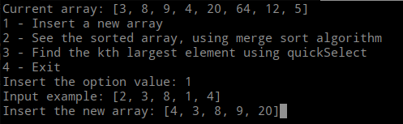
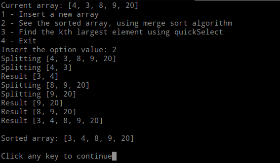
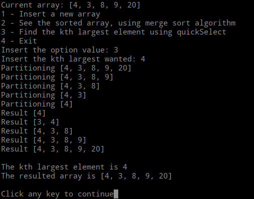

# MergeSort and Select

**Número da Lista**: 4<br>
**Conteúdo da Disciplina**: Dividir e Conquistar<br>

## Alunos
|Matrícula | Aluno |
| -- | -- |
| 16/0154197  |  Rossicler Rodrigues Pires Júnior |
| xx/xxxxxx  |  xxxx xxxx xxxxx |

## Sobre 
O objetivo do projeto é a aplicação de alguns algoritmos de dividir e conquistar apresentados durante a aula. Tentando mostrar o passo a passo tomado pelo algoritmo.

## Screenshots
### Adicionando um novo array

### Ordenando o array usando MergeSort

### Encontrando o kth maior elemento usando QuickSelect



## Instalação 
**Linguagem**: Python3<br>
```console
$ python3 main.py
```


